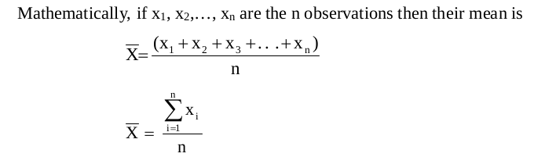
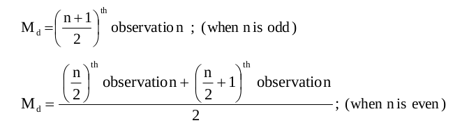

# Statistics Refresher
## Central Tendency
According to **Professor Bowley**, averages are “statistical constants which
enable us to comprehend in a single effort the significance of the whole”. They
throw light as to how the values are concentrated in the central part of the distribution.

For this reason they are also called the measures of central
tendency, an average is a single value which is considered as the most
representative for a given set of data
### Mean
Arithmetic mean (also called mean) is defined as the sum of all the
observations divided by the number of observations

```python
# Calculate mean using numpy
import numpy as np
np_array = np.array([1, 2, 3, 4, 5])
np.mean(np_array) # answer is 3.0

# Calculate mean using pandas
dataset = pd.read_csv('00_pizza_cost_per_city_in_India.csv')
# Mean pizza cost in Hyderabad
dataset['Pizza Cost Hyderabad in Dollars'].mean()
```

### Median
Median is that value of the variable which divides the whole distribution into
two equal parts.

Mathematically, if x 1 , x 2 ,..., x n are the n observations then for obtaining the
median first of all we have to arrange these n values either in ascending order
or in descending order.


```python
# Calculate median using numpy
import numpy as np
np.median(np.array([1, 2, 3, 4, 5]))  # 3 is answer
np.median(np.array([1, 2, 3, 4, 5, 6]))  # 3.5 is answer(i.e) mean of 3 and 4  is answer

# Calculate median using pandas
# import essential libraries
import pandas as pd
dataset = pd.read_csv('00_pizza_cost_per_city_in_India.csv')
# Median pizza cost in Hyderabad
dataset['Pizza Cost Hyderabad in Dollars'].median()
```
### Mode
Highest frequent observation in the distribution is known as mode. In other
words, mode is that observation in a distribution which has the maximum
frequency.
```python
# Calcuate mode using numpy and scipy
import numpy as np
from scipy import stats
np_array = np.array([1, 2, 3, 3, 4, 5])
stats.mode(np_array)  # Answer is 3

# Calculate mode using pandas
# import essential libraries
import pandas as pd
dataset = pd.read_csv('00_pizza_cost_per_city_in_India.csv')
# Mode pizza cost in Hyderabad
dataset['Pizza Cost Hyderabad in Dollars'].mode()

```
